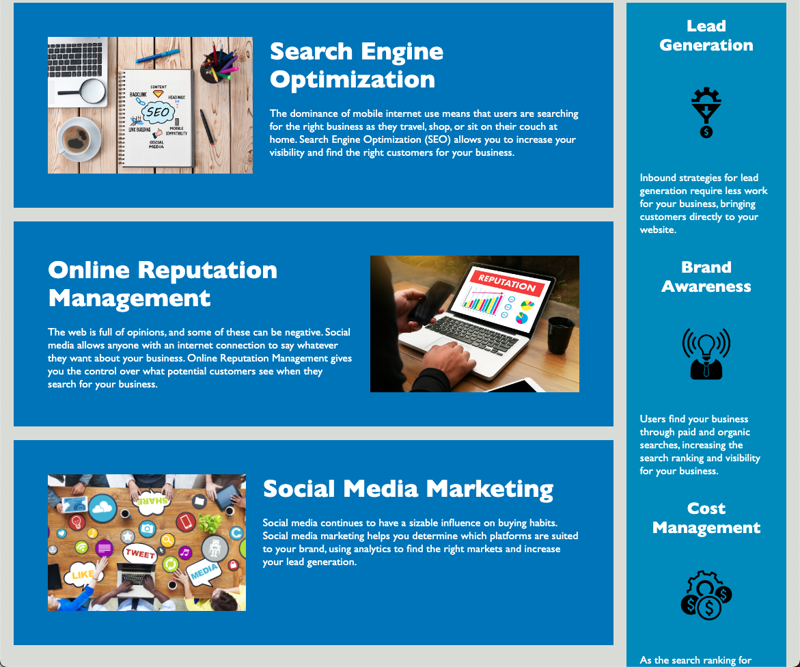

# Module-Challenge-1

## Description

This is a website developed by the ficticious company HoriSEOn. The company HoriSEOn aims to help users / customers grow their businesses online.
The website shows several ways on how HoriSEOn will help you grow your business. These include how to improve your Search Engine Optimization, how to manage your Online Reputation,
and how to market on social media. The website also explains how these key concepts can benefit the user / customer. Some benefits to working with HoriSEOn are online lead generation,
brand awareness (making it easier for customers to find your online business), and cost management. HoriSEOn believes through it's services the user can increase their search ranking,
therfore lowing the advertising cost. 

## Installation

N/A

## Usage

To use this website most effectively you would navigate to the sections describing key ways to grow your online business and then assess the benefits of following HoriSEOn's directions.

Link to deployed application:

## Credits

N/A

## License

MIT License

Copyright (c) [2022] [Evan Towlerton]

Permission is hereby granted, free of charge, to any person obtaining a copy
of this software and associated documentation files (the "Software"), to deal
in the Software without restriction, including without limitation the rights
to use, copy, modify, merge, publish, distribute, sublicense, and/or sell
copies of the Software, and to permit persons to whom the Software is
furnished to do so, subject to the following conditions:

The above copyright notice and this permission notice shall be included in all
copies or substantial portions of the Software.

THE SOFTWARE IS PROVIDED "AS IS", WITHOUT WARRANTY OF ANY KIND, EXPRESS OR
IMPLIED, INCLUDING BUT NOT LIMITED TO THE WARRANTIES OF MERCHANTABILITY,
FITNESS FOR A PARTICULAR PURPOSE AND NONINFRINGEMENT. IN NO EVENT SHALL THE
AUTHORS OR COPYRIGHT HOLDERS BE LIABLE FOR ANY CLAIM, DAMAGES OR OTHER
LIABILITY, WHETHER IN AN ACTION OF CONTRACT, TORT OR OTHERWISE, ARISING FROM,
OUT OF OR IN CONNECTION WITH THE SOFTWARE OR THE USE OR OTHER DEALINGS IN THE
SOFTWARE.

## Features

N/A

## How to Contribute

N/A

## Tests

N/A
